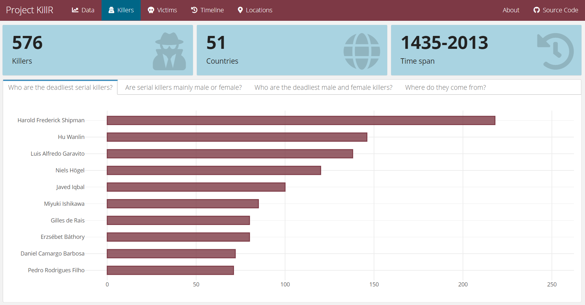

```{r setup, include=FALSE}
options(htmltools.dir.version = FALSE)
```

```{r xaringan-themer, include=FALSE}
library(xaringanthemer)
mono_light(base_color = "#88398a",
           header_font_google = google_font("Open Sans", "600"), 
           text_font_google   = google_font("Open Sans", "300", "300i"))
```

class: center, middle

## <font size='6'>"R is a big part of who I am. I'm very involved in the R community. R is the thing I'm most passionate about."</font> <br> <font size='5'>Gabriela de Queiroz, Founder of R-Ladies</font>

```{r, fig.align="center", echo=FALSE, out.width="250px"}

``` 

???

Image credit: [https://k-roz.com/about/](https://k-roz.com/about/)


---
class: inverse, center, middle

# Start with WHY

---

## "Why should I learn R? Isn't it yet another programming language?"

--

1. Supportive, diverse, and inclusive community (one word: [DataCamp `r emo::ji('clap')`](https://www.buzzfeednews.com/article/daveyalba/datacamp-sexual-harassment-metoo-tech-startup))

--

2. Free and open source software with >15k packages on CRAN

--

3. Extensive documentation and community support

--

4. Go-to programming language for statistical analysis and data visualization

--

5. Widely used in academia (no `r emo::ji('money')`), data-driven journalism (also no `r emo::ji('money')`), and the industry (`r emo::ji('money')`)

--

6. Why I *personally* love R: Learning how to fail, finding out why (thanks to Google and Stack Overflow), trying again, failing better, learning from this experience (aka refining Google searches), and eventually having a moment of instant gratification when the code runs through (or not) `r emo::ji('pray')`


---

## Some example projects: [#tidytuesday](https://github.com/rfordatascience/tidytuesday) data viz

```{r, fig.align="center", echo=FALSE, out.width = "600px"}

```

.center[[Cédric Scherer | @CedScherer](https://cedricscherer.netlify.com/top/dataviz/)]


---

## Some more example projects: trashy animations

```{r, fig.align="center", echo=FALSE, out.width = "600px"}

```

.center[[Lisa Reiber & Indra Patil | @lisa_reiber & @patilindrajeets](https://github.com/TripLLL/weRnuts3)]


---

## Even more example projects: killR interactive dashboard

```{r, fig.align="center", echo=FALSE}

```

.center[[Me (sneaky self promo)](https://www.dataplanes.org/project-killR/)]

---
class: inverse, center, middle

# HOW

---

## How do you use R?

It's pretty simple:

--

.center[

]


---

## But before you can start typing R code, you first have to install the required software.

+ Download **R**: [https://cran.r-project.org/](https://cran.r-project.org/)

+ Download **RStudio**: [https://rstudio.com/products/rstudio/](https://rstudio.com/products/rstudio/)


---
class: inverse, center, middle

# It's your turn to install the software. <br> If you already did, please help others who aren't there yet!


---

## This is what RStudio looks like:

```{r, fig.align="center", echo=FALSE}

```


---

## Now that you have the prerequisites ready, let's continue with the extras: packages!

```{r, paged.print=FALSE, eval=FALSE}
# Install {swirl} package
install.packages('swirl')

# See which packages are already installed
library()

# Load the {swirl} package
library(swirl)

# Need help?
help(swirl)
```

---

## "Do I have to type this every time? That's a lot of code..."

In short: no. You can use so-called *R scripts* to store (and rerun) your code: 

*File -> New File -> R Script (or Ctrl + Shift + N)*

```{r, fig.align="center", echo=FALSE, out.width = "600px"}

```

---

## Please try it youRself:

Open a new R script, type the solutions to the exercises below, and run it. 

If you don't know how to do it (yet), that's perfectly normal! We'll find out together.

--

1. Add 2 + 2 in R.

2. Print *"Hello, R-Ladies Berlin!"* to the console (hint: *?print*).

3. Install and load the {tidyverse} package collection (trust me, you'll need it!).

4. Try to assign the result of 2 + 2 to a new variable named x (hint: *<-*).

--

###.center[**Did it work?**]


---

## Here's the solution:

```{r, paged.print=FALSE, eval=FALSE}
# Add 2 + 2.
2 + 2

# Print "Hello, R-Ladies Berlin!" to the console.
print("Hello, R-Ladies Berlin!")

# Install and load the {tidyverse}
install.packages('tidyverse')
library(tidyverse)

# Assign the result of 2 + 2 to a new variable named x
x <- 2 + 2
```


---
class: inverse, center, middle

# Congratulations, you also achieved the WHAT: <br> You wrote and executed your first R code! `r emo::ji('winner')`


---
class: inverse, center, middle

# Now on to the fun stuff: Twitter data!


---

## For the next steps, you need your own Twitter account.

```{r, fig.align="center", echo=FALSE}

```


---

## We're using {rtweet} to download some tweets.

First, we install and load the {rtweet} package.

```{r, paged.print=FALSE, eval=FALSE}
# Install the {rtweet} package
install.packages('rtweet')

# Load the package
library(rtweet)
```

--

Next, we download our data. Choose whichever option you like best:

```{r, paged.print=FALSE, eval=FALSE}
# A: Search for 1k tweets using the rstats hashtag (w/o retweets)
data_raw <- search_tweets('#rstats', n = 1000, include_rts = FALSE)

# B: Get the most recent 1k tweets posted by R-Ladies Global
data_raw <- get_timeline('rladiesglobal', n = 1000)

# C: Get the 1k most recently favorited statuses by Hadley Wickham
data_raw <- get_favorites('hadleywickham', n = 1000)
```


---

## (Yes, *that's* Hadley Wickham.)

.center[

]


---

## First things first: data wrangling

Let's do the following steps together.

```{r, paged.print=FALSE, eval=FALSE}
# Get a glimpse of the data
glimpse(data_raw)

# Select the variables containing the user handle, 
# date, text, and number of favorites
data_subset <- data_raw %>%
  select(screen_name, created_at, text, 
         favorite_count, retweet_count)

# Show all tweets with more than 100 favorites and 
# assign the results to a new variable
data_subset %>%
  filter(favorite_count > 100)
```


---

## And now some basic stats...

```{r, paged.print=FALSE, eval=FALSE}
# Summary statistics
data_subset %>%
  summary()

# Summary stats using {skimr}
install.packages('skimr')
library(skimr)

data_subset %>%
  skim()
```


---

## ...and visualizations...

```{r, paged.print=FALSE, eval=FALSE}
# Plot number of tweets over time using {ggplot2}
data_subset %>% ggplot() + geom_histogram(aes(x = created_at)) +
xlab("Date") + ylab("Number of tweets") +
ggtitle("Tweets over time") + theme_minimal()
```


---

## ...and fancier visualizations.

```{r, paged.print=FALSE, eval=FALSE}
# Install and load the {tidytext} package
install.packages("tidytext")
library(tidytext)

# Install and load the {wordcloud} package
install.packages("wordcloud")
library(wordcloud)

# Clean tweets using {tidytext}
tweets_tidy <- data_subset %>%
  unnest_tokens(word, text) %>%
  anti_join(stop_words) %>%
  count(word)

# Plot wordcloud using {wordcloud} (base R style)
wordcloud(tweets_tidy$word, tweets_tidy$n, colors = "#88398a", 
          min.freq = 5, max.words = 200)
```


---
class: center, middle

# Thanks for listening and happy coding!

Slides made with `r emo::ji('heart')` and R [*xaringan*](https://github.com/yihui/xaringan).